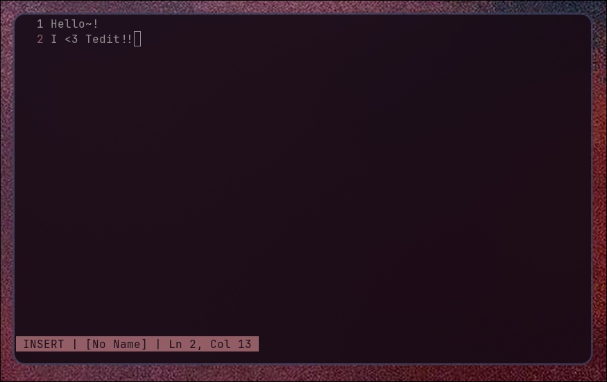

# Tedit

> A fast, minimal, keyboard-driven terminal text editor. Inspired by Vim, built with pure Python.



---

## Features

- Modal editing (Normal, Insert, Visual)
- Vim-style keybindings (`i`, `dd`, `yy`, `p`, `u`, `v`, etc.)
- Word navigation (`w`, `b`)
- Search with `/` and replace with `:replace <search> <replace>`
- Clipboard-style yank and paste (works across buffers)
- Undo / Redo
- Visual selection + deletion
- Line numbers + simple status bar (shows buffer, file, unsaved changes)
- Command mode (`:`) with:
  - `:w` to save
  - `:q` to quit
  - `:wq` to save & quit
  - `:q!` to quit without saving
  - `:e <file>` to open a new file in a buffer
  - `:view <file>` to open a file as read-only
  - `:bn` / `:bp` to switch buffers
  - `:bx` to close the current buffer
  - `:bc` to create a new empty buffer
  - `:b1`, `:b2`, ... to jump to a specific buffer
- Multiple buffers (tabs): open, switch, create, and close files
- File explorer sidebar (toggle with F2, open files with Enter)
- Syntax highlighting for Python and Markdown
- Auto indentation
- Configurable keybindings (see below)
- Persistent session restore (reopen files and positions on restart)
- Mouse support (click to move cursor or open files)
- Theme/color scheme support (dark/light)
- Minimap/overview gutter
- Jump to line (`:goto <line>`)
- Read-only mode (`:view <file>`)
- Integrated help system (`:help` or F1)
- Word wrap toggle (`:wrap`)
- External command integration (`:!cmd`)
- Bookmark/mark system (`m[a-z]`, `'[a-z]`)
- Sidebar navigation with arrow keys and Enter
- Search navigation with `n`/`N`
- Undo/redo history with `:history`
- Replace all with `:replace <search> <replace>`
- Run shell command with `:!<cmd>`
- Theme switching with `:theme <t>`
- Experimental split/unsplit with `:split`, `:vsplit`, `:unsplit`
- Exit confirmation if changes aren’t saved
- Runs in any real terminal (curses-based)
- Fully keyboard controlled
- No external dependencies

---

## Using it through the repository

```bash
git clone https://github.com/s-ar2005/tedit
cd tedit
python3 main.py <filename1> <filename2> ...
```

- Each file will open in its own buffer/tab.

---

## Keybindings & Commands

| Mode    | Key/Command                   | Action                            |
| ------- | ----------------------------- | --------------------------------- |
| Normal  | `i`                           | Enter insert mode                 |
| Normal  | `dd`                          | Delete current line               |
| Normal  | `yy`                          | Yank (copy) line                  |
| Normal  | `p`                           | Paste                             |
| Normal  | `u` / `r`                     | Undo / Redo                       |
| Normal  | `/`                           | Search                            |
| Normal  | `:`                           | Enter command mode                |
| Normal  | `v`                           | Visual mode (select text)         |
| Normal  | `:e <file>`                   | Open file in new buffer           |
| Normal  | `:view <file>`                | Open file as read-only            |
| Normal  | `:bn`/`:bp`                   | Next/previous buffer              |
| Normal  | `:bx`                         | Close current buffer              |
| Normal  | `:bc`                         | Create new empty buffer           |
| Normal  | `:b1`/`:b2`                   | Jump to buffer 1/2/etc            |
| Normal  | `F2`                          | Toggle file explorer sidebar      |
| Normal  | `F3`                          | Toggle line numbers               |
| Normal  | `F1`/`:help`                  | Show help buffer                  |
| Normal  | `:goto <n>`                   | Jump to line n                    |
| Normal  | `:theme <t>`                  | Set theme (dark/light)            |
| Normal  | `:wrap`                       | Toggle word wrap                  |
| Normal  | `:!cmd`                       | Run shell command in buffer       |
| Normal  | `ma`/`'a`                     | Set/jump to mark a                |
| Normal  | `m[a-z]`                      | Set mark `[a-z]` at cursor        |
| Normal  | `'[a-z]`                      | Jump to mark `[a-z]`              |
| Normal  | `n`                           | Next search result                |
| Normal  | `N`                           | Previous search result            |
| Sidebar | `Up/Down`                     | Move selection in sidebar         |
| Sidebar | `Enter`                       | Open selected file                |
| Visual  | `d` / `y`                     | Delete / Yank selected            |
| Visual  | `p`                           | Paste clipboard at cursor         |
| Visual  | `h/j/k/l`                     | Move selection (Vim-style)        |
| Command | `:history`                    | Show undo/redo history            |
| Command | `:replace <search> <replace>` | Replace all                       |
| Command | `:!<cmd>`                     | Run shell command in buffer       |
| Command | `:help`                       | Show help buffer                  |
| Command | `:theme <t>`                  | Set theme (dark/light)            |
| Command | `:split`/`:vsplit`/`:unsplit` | (Experimental) Split/unsplit view |
| Insert  | `Esc`                         | Return to normal mode             |
| Any     | `Arrow Keys`                  | Move cursor                       |
| Normal  | `Esc`                         | Exit with confirmation dialog     |

---

## Configurable Keybindings

You can customize all keyboard shortcuts by creating a JSON file at `~/.config/tedit.json` (preferred, global) or `keybindings.json` (local, project directory). If neither exists, built-in defaults are used.

Example `~/.config/tedit.json`:

```json
{
  "insert": "i",
  "left": "h",
  "right": "l",
  "up": "k",
  "down": "j",
  "word_forward": "w",
  "word_backward": "b",
  "yank": "y",
  "delete": "d",
  "paste": "p",
  "undo": "u",
  "redo": "r",
  "search": "/",
  "visual": "v",
  "escape": 27,
  "toggle_sidebar": 266,
  "toggle_line_numbers": 267,
  "page_up": 339,
  "page_down": 338,
  "tab": 9,
  "f1": 265,
  "f2": 266,
  "f3": 267,
  "delete_key": 330
}
```

---

## External Syntax Highlighting

You can add your own syntax highlighting for any file extension by placing a Python file in `~/.config/tedit/` named after the extension. For example:

- `py.py` for Python files
- `js.py` for JavaScript files
- `sh.py` for shell scripts
- `md.py` for Markdown files

Each file should define a function:

```python
def highlight_line(line, filetype):
    # Return the highlighted line using \x01...\x02 for keywords, \x03...\x02 for comments, \x04...\x02 for strings
    return line
```

**Example for `~/.config/tedit/sh.py`:**
```python
def highlight_line(line, filetype):
    import re
    keywords = r'\b(if|then|else|elif|fi|for|while|do|done|in|case|esac|function|select|until|break|continue|return|exit|export|local|readonly|declare|typeset|let|eval|exec|set|unset|shift|test)\b'
    line = re.sub(keywords, lambda m: '\x01' + m.group(0) + '\x02', line)
    line = re.sub(r'#.*', lambda m: '\x03' + m.group(0) + '\x02', line)
    line = re.sub(r'("[^"]*"|\'[^"]*\')', lambda m: '\x04' + m.group(0) + '\x02', line)
    return line
```

The editor will use the highlighter matching the file's extension. If no custom highlighter is found, the built-in one is used.

---

## Roadmap

- ~~Configurable keybindings~~
- ~~Syntax highlighting~~
- Plugin system
- ~~Tabs/splits?~~ (multi-buffer support)
- Written in C version someday?

---

## License

MIT — do whatever you want with it.

---

## Made by Sarah <3